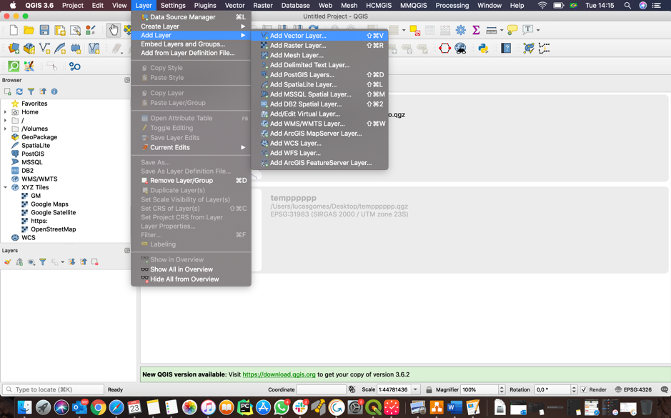
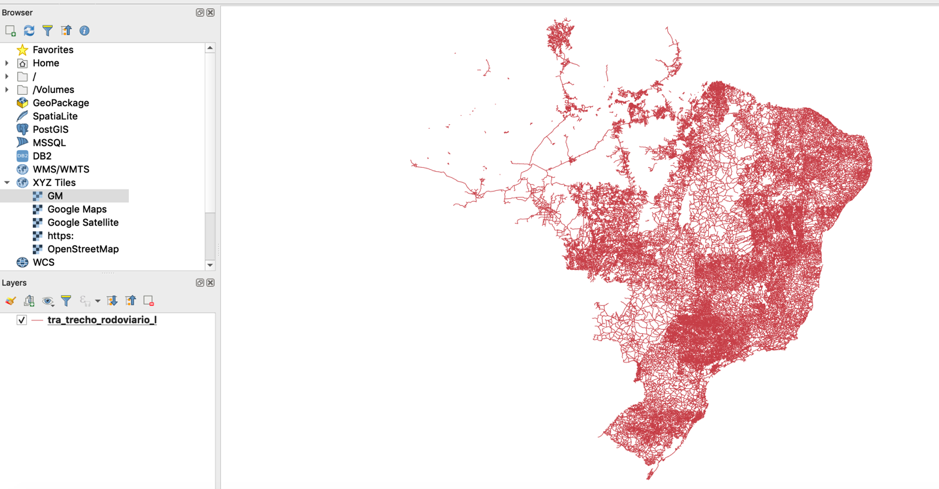
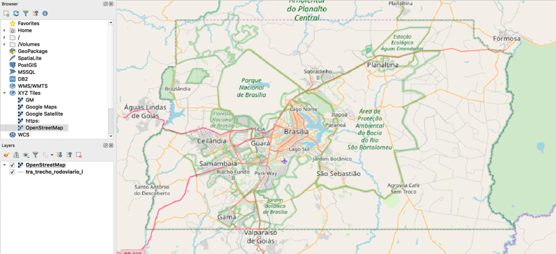
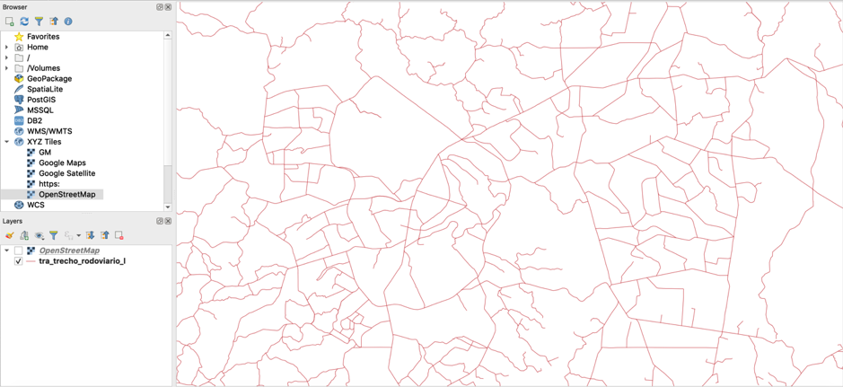
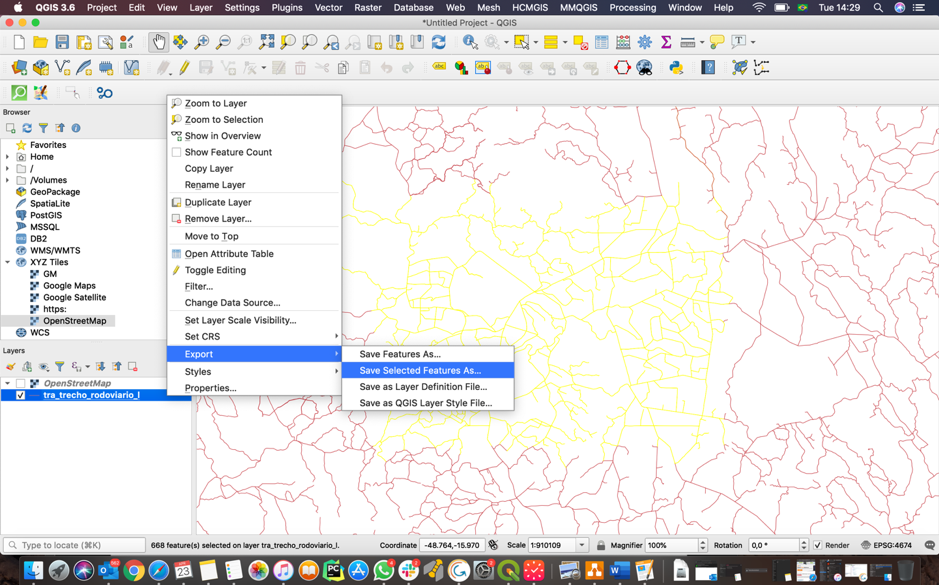
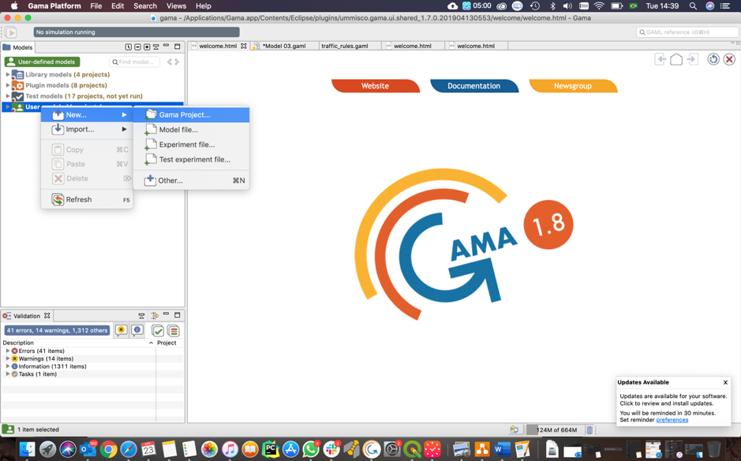
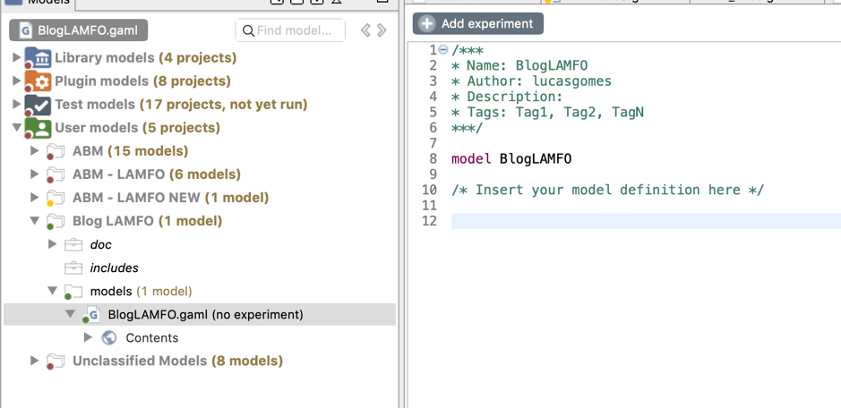
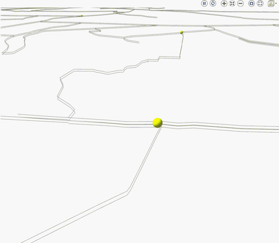
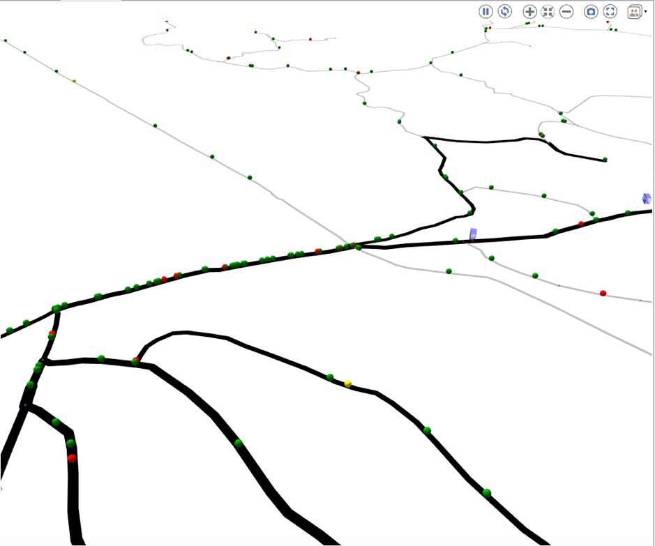
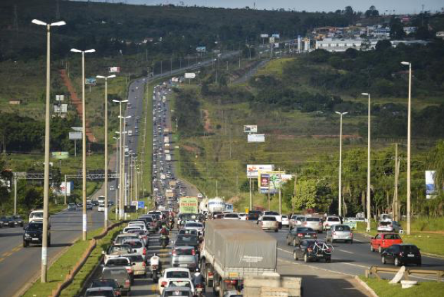

# Simulação baseada em Agentes com Gama Platform para simulação de trânsito em rodovias de Brasília e do Distrito Federal


 
---

## Simulação Baseada em Agendes para análise de Trânsito

   Simular o trânsito de grandes cidades é um grande desafio por vários motivos, os quais vão desde a complexidade de se formular matematicamente a complexidade da movimentação dos carros em horários e situações específicas do dia a dia, como um acidente ou um buraco na pista. Entretanto, uma coisa é fato: o problema da mobilidade em grandes centros urbanos é custosa e diretamente ligado à qualidade de vida.
    
Em megalópoles, como Nova Iorque, soluções igualmente complexas ao trânsito foram desenvolvidas e implementadas, com semáforos sincronizados de maneira a tentar minimizar o congestionamento. Entretanto, essas soluções não são facilmente replicáveis a outros cenários, especialmente quando a extensão da área analisada se torna muito grande.
	
É nesse cenário de complexidade que a simulação baseada em agentes se faz útil. Não é simples analisar o movimento complexo de um conjunto de carros ao longo do dia, mas é (mais) simples imaginar o padrão de comportamento de um único indivíduo. Por exemplo: não é exagero inferir com certa confiança que uma pessoa, em geral, sai para o trabalho 8:30 da manhã e volta 18h para casa, com uma variação de 30 minutos média. Suposições como essas, simples, quando simuladas em grande escala, são capazes de gerar um padrão de comportamento complexo, que não seria facilmente possível por outras técnicas. 

## Simulação baseada em Agentes

Mas o que é simulação baseada em agentes? A simulação baseada em agentes nada mais é que a simulação individual de agentes (indivíduos, por exemplo), do nível mais baixo da interpretação de um fenômeno, para a compreensão de algo mais complexo, advindo do conjunto das ações individuais.

Por exemplo, o movimento de pássaros voando em conjunto, é algo matematicamente (e biologicamente) bastante complexo. Por trás da complexidade desses movimentos, porém, se esconde um padrão de pura simplicidade.
	
	

*https://www.slideshare.net/premsankarchakkingal/introduction-to-agent-based-modeling-using-netlogo*

Se simularmos um simples pássaro, podemos com poucos parâmetros compreender o resultado do conjunto de interações. [Em código disponível no NetLogo](https://ccl.northwestern.edu/netlogo/models/Flocking) (software consagrado para análises de ABM), são usados 3 simples principais parâmetros para analisar esse caso: alinhamento, separação e coesão. 

## GAMA Platform

Apesar de softwares como o NetLogo serem mais famosos para se trabalhar com a simulação baseada em agentes, é importante compreender que cada aplicação irá exigir algumas especificidades que podem favorecer um ou outro software. O artigo [Agent Based Modelling and Simulation tools: A review of the state-of-art software](https://www.researchgate.net/publication/316002244_Agent_Based_Modelling_and_Simulation_tools_A_review_of_the_state-of-art_software) faz uma análise comparative dos softwares disponíveis. Aqui usaremos o GAMA Platform, devido à sua boa integração com dados georreferenciados. 

A plataforma GAMA é um software de simulação utilizado para reproduzir n-agentes simultaneamente, e os visualizar de maneira gráfica atualizada em tempo real. O diferencial da plataforma, que possui linguagem própria (GAML), é a integração simples com arquivos de informação espacial GIS. Outras opções são usadas para a mesma finalidade.

## Importando os arquivos de rodovias para análise

Para representar as ruas que serão usadas na análise, precisamos que estas estejam em formato compatível, com arquivos de shapefile. Assim, utilizaremos o arquivo Transporte_v2017.zip, disponível [neste link]( http://forest-gis.com/2009/04/base-de-dados-shapefile-do-brasil-todo.html/ ). 

Uma vez com os arquivos, devemos extrair o arquivo zip e com algum software de visualização de arquivos GIS editarmos o que precisamos. Aqui, utilizaremos o software QGIS, de código livre. 

Na tela principal do QGIS, clique em Add Vector Layer


Em seguida, escolha o arquivo “tra_trecho_rodoviario_I.shp”. Após carregar o arquivo, devemos ter a visão das rodovias de todo o Brasil.


Podemos então refinar nossos dados para apenas a área desejada, para então reduzirmos nosso espaço de análise e tornarmos a simulação factível e interpretável. Com o uso do plugin OpenLayers, é possível ter uma visão cartográfica, para auxiliar no processo de escolher a região desejada. Com essa camada ativada no lado esquerdo inferior, podemos dar zoom na região do Distrito Federal, e em seguida desselecionar a camada cartográfica e visualizar apenas as rodovias do local.




Com a camada selecionada no lado esquerdo inferior, podemos usar a ferramenta select feature by area (botão amarelo) e escolher a região desejada, arrastando o mouse sobre a área desejada. 

Com a área selecionada em destaque, podemos clicar com o lado direito sobre a camada tra_trecho_rodoviario_I e escolhe a opção save selected features as, e escolher salvar o arquivo em formato shapefile (.shp).



Pronto, agora já temos os arquivos base para as rodovias que iremos usar em nossa simulação.

## GAMA Language – GAML

A simulação baseada em agentes se parece com a programação orientada à objetos. Temos variáveis e propriedades globais, bem como agentes, que são definidos com propriedades gerais e específicas. Assim, podemos herdar valores e funções em diferentes níveis para formar o agente com as características que precisarmos.

A simulação funciona em ticks, que funcionam como passagens do tempo. Quando se inicia uma simulação no GAMA, apenas o tick inicial é executado, sendo todos os demais executados de acordo com a passagem do tempo simulado ou critérios específicos.
	
Para iniciarmos nossa simulação, devemos primeiro criar um projeto e um arquivo .gaml.


De início são criados dois principais diretórios, includes (onde irão todos arquivos que servirão de input para nosso modelo) e models (onde ficarão nosso código).



Com os arquivos gerados na etapa anterior, devemos colocá-los na pasta includes, e importa-los dentro da definição Global com o seguinte comando:

```
global{
	file shape_file_roads <- ("../includes/rodoviasdf.shp");
	}
```

Aproveitamos para definir a geometria das ruas.
	
```
global{
	file shape_file_roads <- ("../includes/rodoviasdf.shp");
	geometry shape <- envelope(shape_file_roads);
	}
```
Em seguida, precisamos definir como o agente rodovia será. Aqui, vamos apenas dizer que a rua se parecerá com a geometria que o próprio arquivo trás consigo.

```
species rodovia {
		aspect base {
			draw shape color: #gray;
		}
	}
```
Em seguida, precisamos criar uma janela que será capaz de plotar as ruas, com as características que definimos como base.

```
experiment plota_a_rodovia type:gui{
	output {
		display visao_superior type: opengl {
			species rodovia aspect: base refresh: false;
			}}}
```
Se rodarmos o experimento plota_a_rodovia (um botão verde deve aparecer automaticamente com esse nome, caso não haja erro de compilação), veremos que nada acontece. Isso porque não dissemos quem deve ser criado, nem quantos agentes devem ser criados. No nosso caso, devemos criar todas as rodovias desejadas, as quais serão um tipo de agente. Assim, precisamos utilizar o comando create dentro de init. 

Init representa um conjunto de ações que ocorrem somente uma vez, quando a simulação é criada. O init, por não se tratar de um comando específico de nenhum agente, mas sim do universo, fica dentro de global. 

```
global{
	file shape_file_roads <- ("../includes/rodoviasdf.shp");
	geometry shape <- envelope(shape_file_roads);
	init {
		create rodovia from: shape_file_roads;
		}
	}
```


## Limpando os dados para as ruas

As ruas não podem apenas estar plotadas no nosso mapa para que possam servir de ruas navegáveis. Precisamos, portanto, transformar as ruas em grafos com suas conexões funcionando como nós. Para isso, precisamos realizar alguns passos para garantir que teremos um grafo que conecta todos os pontos, evitando erros de roteirização impossível (não existe caminho entre dois pontos), ruas soltas (não se conectam de nenhuma forma ao grafo) ou simplesmente defeitos no arquivo (ruas com 2 metros de distância da realidade, criando um espaçamento não existente).

Assim, antes de criar as ruas do arquivo importado, precisamos usar uma função especificamente desenvolvida para limpar esses dados, antes de criar o agente rodovia: clean_network(rua, tolerância, une sobreposições, mantém um só grafo).  

```
global{
	file shape_file_roads <- ("../includes/rodoviasdf.shp");
	geometry shape <- envelope(shape_file_roads);
	init {
		list<geometry> var0 <- clean_network(shape_file_roads.contents, 10, true, true);
		create rodovia from: var0;
		}
	}
```

Assim, criamos uma lista de geometrias temporárias, as quais usamos para criar as ruas em seguida.

Entretanto, estamos deixando algumas informações de fora quando não analisamos o número de faixas e vias. Para isso, podemos simplesmente usar as informações que já vem nos arquivos GIS e criar uma variável para cada rua com esse atributo usando o comando: with: [variável::formato(procura(nome_da_coluna)),...].

```
global{
	file shape_file_roads <- ("../includes/rodoviasdf.shp");
	geometry shape <- envelope(shape_file_roads);
	init {
		list<geometry> var0 <- clean_network(shape_file_roads.contents, 10, true, true);
		create rodovia from: var0 with: [lanes::int(read("nrfaixas")),vias::int((read("nrpistas"))];
		}
	}

species rodovia {
		int vias;
		int lanes;
		aspect base {
			draw shape color: #gray;
			}
		}
```
Em seguida precisamos garantir que exista uma via para cada sentido da pista, já que as pistas devem ser direcionais. Assim, para cada pista, deverá haver uma outra de iguais propriedades, e geometria invertida. Além disso precisamos explicitamente garantir que as ruas estejam conectadas umas as outras. Quando chamamos um agente dentro da função de outro agente, nos referimos ao mais recente como self, e ao mais antigo como myself (o que chamou a função primeiro). 

```
global{
	file shape_file_roads <- ("../includes/rodoviasdf.shp");
	geometry shape <- envelope(shape_file_roads);
	init {
		list<geometry> var0 <- clean_network(shape_file_roads.contents, 10, true, true);
		create rodovia from: var0 with: [lanes::int(read("nrfaixas")),vias::int((read("nrpistas"))]{
			create rodovia {
				lanes <- myself.lanes;
				shape <- polyline(reverse(myself.shape.points));
				linked_road <-myself;
				myself.linked_road <- self;
		}}}}

species rodovia skills: [skill_road]{
		int vias;
		int lanes;
		aspect base {
			draw shape color: #gray;
			}
		}
```

Agora temos os links do nosso grafo, precisamos apenas do nós. Para criar o nós, criamos um grafo de linhas temporário, e em seguida passamos em cada vértice e criamos um agente nó naquela localização. 

```
global{
	file shape_file_roads <- ("../includes/rodoviasdf.shp");
	geometry shape <- envelope(shape_file_roads);
	init {
		list<geometry> var0 <- clean_network(shape_file_roads.contents, 10, true, true);
		create rodovia from: var0 with: [lanes::int(read("nrfaixas")),vias::int((read("nrpistas"))]{
			create rodovia {
				lanes <- myself.lanes;
				shape <- polyline(reverse(myself.shape.points));
				linked_road <-myself;
				myself.linked_road <- self;
		}}
		graph tenp_graph <- as_edge_graph(rodovia);
		loop v over: temp_graph.vertices {
			create no with: [location::point(v)];
			}
		}}

species no skills: [skill_road_node];
.
.
.
```

Para juntar os links e nós em um grafo que se possa dirigir, declaramos um grafo em global (já que será usado fora de init) e usamos a função as_driving_graph() para retornar o grafo unindo linhas e nós. 

```
global{
	file shape_file_roads <- ("../includes/rodoviasdf.shp");
	geometry shape <- envelope(shape_file_roads);
	init {
		list<geometry> var0 <- clean_network(shape_file_roads.contents, 10, true, true);
		create rodovia from: var0 with: [lanes::int(read("nrfaixas")),vias::int((read("nrpistas"))]{
			create rodovia {
				lanes <- myself.lanes;
				shape <- polyline(reverse(myself.shape.points));
				linked_road <-myself;
				myself.linked_road <- self;
		}}
		graph tenp_graph <- as_edge_graph(rodovia);
		loop v over: temp_graph.vertices {
			create no with: [location::point(v)];
			}
		the_graph <- as_driving_graph(rodovia, no);
		
		}}
.
.
.
```
Para criar os carros, precisamos definir alguns elementos básicos como quantidade de carros, localização e velocidade máxima. Aqui, a localização inicial será dada por um nó aleatório, e a velocidade e número de carros serão números inteiros fixos, por questões de simplificação. Para garantir que o carro seja iniciado corretamente em nosso sistema, devemos criar um alvo aleatório e calcular o caminho dele com a função compute_path(). 

```
create carro number:10{
	location <- one_of(no).location;
	max_speed <- 80.km/.h;
	no the_target <- one_of(no);
	try(do compute_path(graph: the_graph, target:the_target);
	}
```

Lembrando que devemos também definir o agente, explicitando que desejamos usar o atributo advanced_driving. Para definir uma função que será chamada a cada tick, usamos o termo reflex. Aqui, faremos com que os carros andem de maneira aleatório em cada tick. 

```
species carro skills: [advanced_driving]{
	reflex andar_aleatorio {
		do drive random;
	}
	
	aspect base {
		draw sphere(50) color: #yellow;
	}
}
```
O resultado visual desse modelo é esse:



Analisando o equivalente à descida do colorado (DF150), percebemos uma densidade de veículos maior nessa área.



De fato, a região é uma das de maior trânsito na cidade, estando inclusive passando por uma obra de ampliação prevista para acabar em 2019


*http://www.jornalregional.com.br/noticia/7099/EPIA-NORTE:-Ponto-de-entrada-e-sa%C3%ADda-da-faixa-reversa-do-Colorado-será-deslocado-a-partir-desta-quarta-(6).html*

Simulações como essa poderiam ser usadas para diversas finalidades. Seguindo o exemplo analisado, poderíamos usar essa simulação para analisar o trânsito caso adicionássemos mais uma via em outro local, ou caso quiséssemos observar o efeito de se ampliar as vias já existentes.  

## Extensão do modelo

Esta foi a base do modelo para simulação de trânsito em casos do mundo real. Vale ressaltar que, apesar de ser relativamente complexa a modelagem utilizando o pacote de habilidades advanced driving skill, os resultados são muito mais fidedignos devido à dezenas de atributos que são herdados automaticamente, como inercia para freiar, probabilidade de quebrar o carro (como decorrente de um acidente), distância do veículo da frente, velocidade máxima entre muitas outras. Para conferir o artigo que trata do advanced driving skill, leia [Traffic simulation with the GAMA platform ](https://hal.archives-ouvertes.fr/hal-01055567/document). 

Entretanto, vale ressaltar que modelos usando pacotes mais simples podem ter resultado tão positivo quanto o aqui apresentado. No site da plataforma, um [tutorial rápido ensina a montar um modelo de análise de trânsito em uma cidade onde os moradores tem um endereço residencial, e um local de trabalho](https://gama-platform.github.io/wiki/RoadTrafficModel). O modelo, por usar um pacote de habilidade mais simples (moving skill) é capaz de gerar esse cenário com relativa simplicidade.
